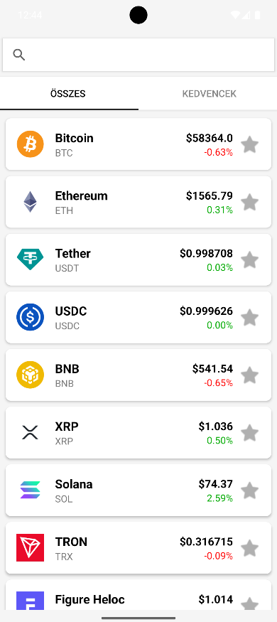
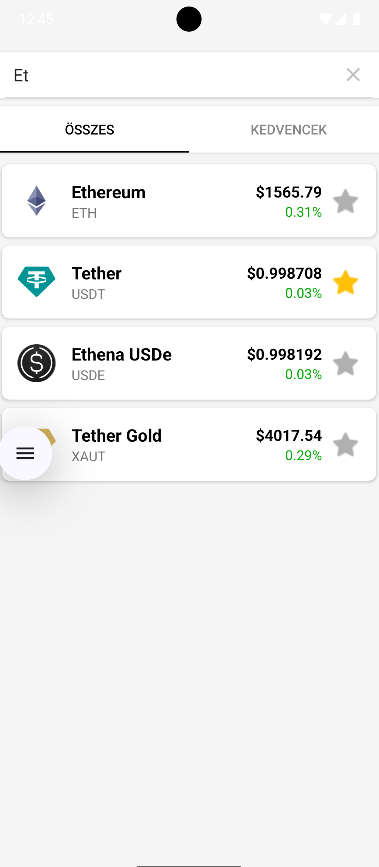
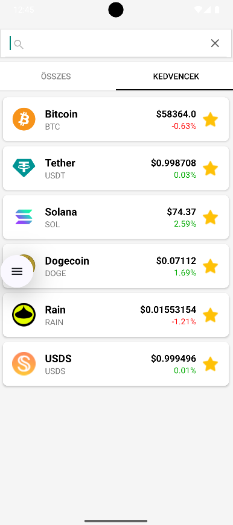
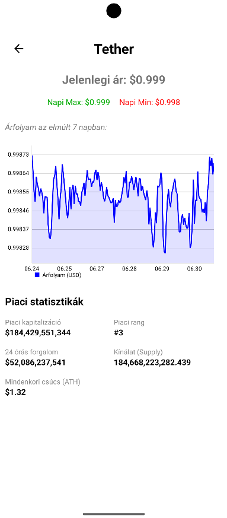

# Cryptocurrency Market Tracker 📈

A modern, responsive, and user-friendly native Android application built with Java that tracks real-time market data and historical price charts for the top cryptocurrencies. 

This project was developed to demonstrate proficiency in Android UI/UX design, asynchronous network requests, local data persistence, and interactive data visualization.

## 📱 Screenshots

  
  
  
  

## ✨ Key Features

*   **Real-time Market Data:** Fetches and displays current prices, 24-hour changes, and market capitalization for the top cryptocurrencies.
*   **Dynamic Search & Filtering:** Instantly filter the cryptocurrency list by name or ticker symbol.
*   **Favorites System (Local Storage):** Users can bookmark their preferred coins. Favorites are saved persistently across app sessions using `SharedPreferences`.
*   **Interactive Historical Charts:** Detailed view features a 7-day line chart with custom formatters to convert UNIX timestamps into readable dates, complete with a touch-interactive pop-up marker (MarkerView).
*   **Tabbed Navigation:** Clean and intuitive UI logic separating the "All Coins" and "Favorites" views.

## 🛠️ Tech Stack & Libraries

*   **Language:** Java
*   **Environment:** Android Studio
*   **Networking:** [Retrofit2](https://square.github.io/retrofit/) & Gson for asynchronous REST API calls and JSON deserialization.
*   **Image Loading:** [Glide](https://github.com/bumptech/glide) for smooth, cached loading of cryptocurrency logos.
*   **Data Visualization:** [MPAndroidChart](https://github.com/PhilJay/MPAndroidChart) for rendering complex, interactive historical price graphs.
*   **API:** Powered by the free [CoinGecko REST API](https://www.coingecko.com/en/api).

## 🧠 Technical Highlights

*   **Optimized Memory Management:** Implemented `RecyclerView` with the `ViewHolder` pattern to ensure smooth scrolling and low memory consumption, even with large datasets.
*   **Asynchronous Operations:** All network requests and image loading operations are executed on background threads to prevent UI freezing and ensure a seamless user experience.
*   **Robust Error Handling:** Designed fallback states and failure callbacks in Retrofit to handle offline scenarios gracefully (e.g., displaying Toast notifications without crashing the app).
*   **Custom Chart Formatters:** Engineered logic to translate raw API timestamps into human-readable data points dynamically on the X-axis of the chart.

## 🚀 Future Improvements

*   **Offline Caching (Room DB):** Migrate from `SharedPreferences` to a local SQLite database using the Room Persistence Library to cache API responses for full offline viewing.
*   **MVVM Architecture:** Refactor the codebase to strictly follow the Model-View-ViewModel (MVVM) design pattern to further decouple UI logic from data management.

## 👤 Author

**Bence Oros**
*   LinkedIn: [Oros Bence](www.linkedin.com/in/oros-bence-512674109)